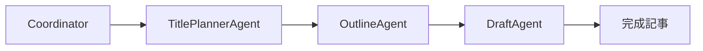

# OpenAI Agents SDK マルチエージェント記事生成システム

このプロジェクトは **OpenAI Agents SDK** を使用したマルチエージェントシステムの実装例です。複数の専門エージェントが連携して、高品質な技術記事を自動生成します。

## 🎯 プロジェクト概要

### システム構成



1. **Coordinator**: ワークフロー全体を統括
2. **TitlePlannerAgent**: SEO 最適化されたタイトルを生成
3. **OutlineAgent**: 構造化されたアウトラインを作成
4. **DraftAgent**: Gemini API で高品質な記事本文を生成

### 主な機能

- 🤖 **マルチエージェント連携**: 専門性の高いエージェント間でのハンドオフ
- 🌐 **Web Grounding**: Gemini API の Grounding 機能で最新情報を取得
- 📊 **詳細トレーシング**: OpenAI Platform での実行状況可視化
- 🔄 **フォールバック機能**: 複数モデルでの冗長性確保
- 💾 **自動保存**: 記事ファイルとデータベースへの自動保存

## 🚀 セットアップ

### 1. 環境構築

```bash
# リポジトリのクローン
git clone <repository-url>
cd ai_writer

# 仮想環境の作成と有効化
python -m venv .venv
source .venv/bin/activate  # Linux/Mac
# または
.venv\Scripts\activate  # Windows

# 依存関係のインストール
pip install -r requirements.txt
```

### 2. 環境変数の設定

`.env` ファイルを作成し、以下の環境変数を設定してください：

```bash
# OpenAI API設定（必須）
OPENAI_API_KEY=sk-proj-your-openai-api-key

# Gemini API設定（必須）
GEMINI_API_KEY=your-gemini-api-key

# データベース設定（オプション）
DB_HOST=localhost
DB_PORT=3306
DB_USER=your-db-user
DB_PASSWORD=your-db-password
DB_NAME=your-db-name

# トレーシング設定（オプション）
OPENAI_AGENTS_DISABLE_TRACING=false
OPENAI_AGENTS_RECORD_SENSITIVE_DATA=false
```

### 3. データベースセットアップ（オプション）

```bash
# MySQLにテーブルを作成
mysql -u your-user -p your-database < schema.sql
```

## 📖 使用方法

### 基本的な実行

```bash
# 記事生成の実行
python run.py
```

### プログラムからの使用

```python
from ai_agents.coordinator import coordinator_agent
from agents import Runner
from tracing_config import get_run_config

# エージェント実行
result = Runner.run_sync(
    coordinator_agent,
    "技術記事を1本生成してください。",
    run_config=get_run_config()
)

print(result.final_output)
```

## 🔍 トレーシング機能

このシステムの最大の特徴の一つが **詳細なトレーシング機能** です。

### トレーシングとは？

OpenAI Agents SDK のトレーシング機能により、以下の情報を詳細に記録・可視化できます：

- 🔄 **エージェント間のハンドオフ**: どのエージェントがいつ実行されたか
- 🛠️ **ツール実行**: 各ツールの実行時間と結果
- 📊 **API 呼び出し**: 外部 API の呼び出し状況と応答時間
- ❌ **エラー情報**: 失敗した処理の詳細な原因
- 📈 **パフォーマンス**: 各処理の実行時間とボトルネック

### トレーシングの確認方法

1. **実行時のログ**:

   ```
   🔍 トレース開始: AI Article Generation Workflow
   📋 Trace ID: trace_002faf91a0ac4801ad6a092b8c321dae
   🌐 詳細確認: https://platform.openai.com/traces/trace_002faf91a0ac4801ad6a092b8c321dae
   ```

2. **OpenAI Platform での確認**:
   - [OpenAI Platform](https://platform.openai.com/traces) にアクセス
   - Trace ID で検索して詳細を確認
   - エージェント間のフローを視覚的に確認

### トレーシング設定

```python
# tracing_config.py での設定例
def get_run_config():
    return RunConfig(
        # トレーシングを有効化
        enable_tracing=True,
        # 機密データの記録設定
        record_sensitive_data=False
    )
```

### デバッグでの活用

トレーシング機能は以下のデバッグ作業で非常に有効です：

- **ハンドオフの問題**: エージェント間の連携が正常に動作しているか
- **ツールの実行状況**: 各ツールが期待通りに動作しているか
- **パフォーマンス分析**: どの処理がボトルネックになっているか
- **エラーの原因特定**: 失敗した処理の詳細な原因分析

## 🏗️ アーキテクチャ

### ディレクトリ構造

```
ai_writer/
├── ai_agents/              # エージェント定義
│   ├── coordinator.py      # 統括エージェント
│   ├── title_planner.py    # タイトル生成エージェント
│   ├── outline_agent.py    # アウトライン作成エージェント
│   └── draft_agent.py      # 記事本文生成エージェント
├── tools/                  # ツール関数
│   ├── gemini_tool.py      # Gemini API連携
│   ├── web_tools.py        # Web検索機能
│   ├── db_tools.py         # データベース操作
│   └── file_tools.py       # ファイル操作
├── test/                   # テストファイル
├── articles/               # 生成された記事
├── run.py                  # メイン実行ファイル
├── tracing_config.py       # トレーシング設定
└── requirements.txt        # 依存関係
```

### エージェント設計

各エージェントは単一責任の原則に従って設計されています：

#### TitlePlannerAgent

- **責任**: SEO 最適化されたタイトル生成
- **ツール**: `fetch_recent_titles`, `web_search`
- **出力**: 30 文字以内の魅力的なタイトル

#### OutlineAgent

- **責任**: 構造化されたアウトライン作成
- **ツール**: `web_search`
- **出力**: Markdown 形式のアウトライン

#### DraftAgent

- **責任**: 高品質な記事本文生成
- **ツール**: `gemini_generate`
- **出力**: 2000-4000 文字の完成記事

## 🔧 カスタマイズ

### 新しいエージェントの追加

```python
# 新しいエージェントの作成例
def create_seo_agent() -> Agent:
    return Agent(
        name="SEOAgent",
        instructions="SEO最適化の専門エージェント...",
        tools=[your_seo_tools],
    )
```

### 新しいツールの追加

```python
from agents import function_tool

@function_tool
def your_custom_tool(param: str) -> str:
    """カスタムツールの実装"""
    # ツールの処理
    return result
```

## 🧪 テスト

テストファイルは `test/` ディレクトリに配置されています：

```bash
# 基本的なトレーシングテスト
python test/test_tracing.py

# ワークフローテスト
python test/test_workflow.py

# API権限確認
python test/check_api_permissions.py
```

## 📊 パフォーマンス

### 実行時間の目安

- **タイトル生成**: 10-30 秒
- **アウトライン作成**: 15-45 秒
- **記事本文生成**: 60-180 秒（Grounding 機能使用時）
- **全体**: 2-4 分

### 最適化のポイント

1. **並列処理**: 独立したタスクの並列実行
2. **キャッシュ**: 重複する検索結果のキャッシュ
3. **タイムアウト調整**: 用途に応じたタイムアウト設定

## 🚨 トラブルシューティング

### よくある問題

1. **API キーエラー**:

   ```
   ValueError: OPENAI_API_KEY environment variable is required
   ```

   → `.env` ファイルで API キーを設定してください

2. **タイムアウトエラー**:

   ```
   Timeout after 300 seconds with gemini-2.5-pro
   ```

   → `gemini_tool.py` でタイムアウト時間を調整してください

3. **トレースが表示されない**:
   - OpenAI Platform でプロジェクトが正しく選択されているか確認
   - API キーがプロジェクトキーであることを確認

### デバッグ方法

1. **詳細ログの有効化**:

   ```python
   import logging
   logging.basicConfig(level=logging.DEBUG)
   ```

2. **トレーシング情報の確認**:
   ```python
   from tracing_config import log_trace_info
   log_trace_info(trace_id, "Debug message")
   ```

## 🤝 コントリビューション

1. フォークしてブランチを作成
2. 変更を実装
3. テストを追加
4. プルリクエストを作成

## 📄 ライセンス

MIT License

## 🔗 関連リンク

- [OpenAI Agents SDK Documentation](https://openai.github.io/openai-agents-python/)
- [OpenAI Platform](https://platform.openai.com/)
- [Google Gemini API](https://ai.google.dev/)

---

このプロジェクトは OpenAI Agents SDK の学習・実装例として作成されました。
マルチエージェントシステムの構築やトレーシング機能の活用方法の参考にしてください。
